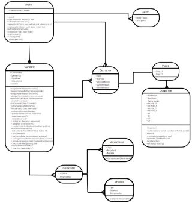
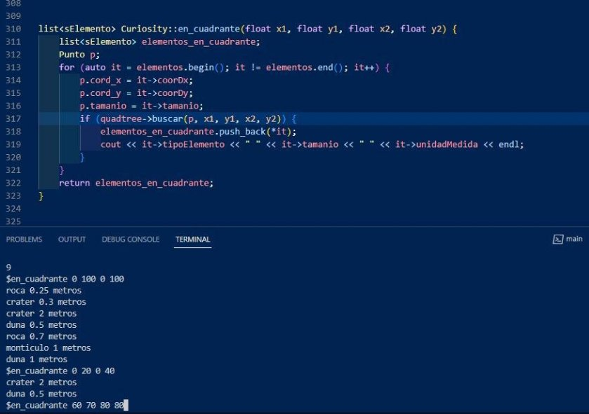
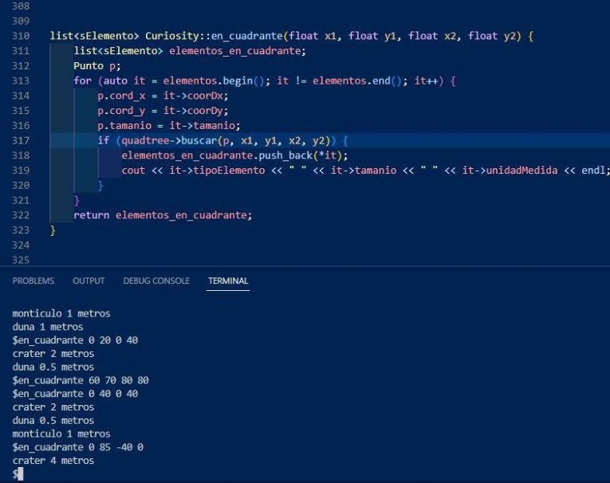
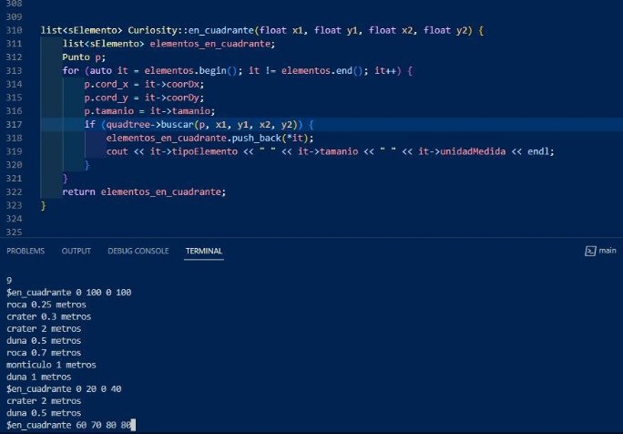
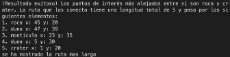

1

del vehículo.

1

Estructuras de Datos Proyecto del curso, 2023-10

El desplazamiento del Curiosity es una tarea crítica en el suelo marciano, ya que una mala planeación y ejecución de la trayectoria puede terminar en un estancamiento del vehículo, poniendo fin así a sus operaciones de exploración. Para validar la correcta ejecución de los comandos de desplazamiento enviados desde la Tierra, el vehículo explorador tiene definido un mecanismo de retroalimentación y validación, utilizando fotografías tomadas por medio de las cámaras instaladas en el frente del vehículo y el análisis de los componentes del suelo marciano.

Peña G. Samuel, Cordoba V. Sebastian,

Álvarez O. Juan José , Rodriguez C. **II. DESCRIPCIÓN DEL PROYECTO** Mauricio y Torres R. Sofia

1\. Comunicación con el “Curiosity”

***Resumen—* Este trabajo muestra el proceso para replicar el software del rover Curiosity de la NASA. Todo esto a través de la utilización de estructuras de datos de árboles y grafos para simular el movimiento y almacenamiento de información del rover.**

***Palabras clave*— Árboles, estructuras de datos, grafos.**

***Abstract—* This work showcases the process of replicating the software of NASA's Curiosity rover using tree and graph data structures to simulate the rover's movement and information storage.**

***Keywords*— Data structures, Graphs, Trees.**

**I. INTRODUCCIÓN**

E

l vehículo "Curiosity", desarrollado por la NASA, es un

robot explorador que lleva a cabo diversos experimentos científicos. Su misión principal es buscar condiciones pasadas o presentes favorables para la vida y condiciones capaces de conservar registros de vida en áreas específicas del planeta Marte. Para cumplir con su misión, el explorador debe desplazarse por el entorno marciano (caracterizado por arena, rocas y montículos) para recolectar fotografías y muestras del entorno. El desplazamiento del vehículo explorador se hace mediante secuencias de comandos enviadas desde la Tierra la noche anterior al día en que se desea sean ejecutadas. Dependiendo de la irregularidad del terreno, el explorador tiene dos maneras diferentes de desplazarse hacia un punto geográfico:

1. Desplazarse según los comandos enviados la noche anterior.

La información que se envía al robot explorador para realizar su misión incluye dos tipos de datos: comandos de desplazamiento, que le permiten moverse sobre la superficie y realizar algunos análisis del suelo marciano; y datos de puntos de interés, que incluyen las ubicaciones geográficas de componentes o elementos hallados en el terreno.

1. Comandos de desplazamiento

Para indicar al vehículo las actividades que puede realizar sobre el suelo marciano, los comandos de desplazamiento y análisis se agrupan en un único archivo de ejecución de comandos, que será el que se enviará al robot la noche anterior. Los comandos son de dos tipos: movimiento y análisis.

- Comandos de movimiento: permiten al robot desplazarse sobre la superficie de Marte. Estos comandos tienen la siguiente estructura:
- tipo\_movimiento
- magnitud
- unidad\_medida

Donde tipo\_movimiento puede ser avanzar o girar, magnitud es el valor o cantidad del movimiento y unidad\_medida es la unidad con la que se hace la medición del movimiento.

- Comandos de análisis: permiten al robot investigar la superficie de Marte para analizar los elementos que va encontrando en su desplazamiento. Estos comandos tienen la siguiente estructura:
- tipo\_análisis
- objeto
- comentario

2

2. Desplazarse de manera autónoma por el terreno hasta una

ubicación dada. Para diseñar su camino, el robot explorador se Dcoomnpdoesiciotinpo\_oanpaelrisfoisrar; poubejdeeto esserel nfoomtobgrreafidaerl, basa en mapas de profundidad generados gracias a dos cámaras elemento sobre el cual se hace el análisis y

ubicadas al frente comentario es un valor opcional que permite agregar  información sobre el análisis a realizar o el elemento

1

3

que se analizará, este comentario debe ingresarse entre comillas simples.

2. Información de elementos:

Para identificar la complejidad del terreno sobre el cual debe moverse el vehículo, se almacena de forma adicional la información de elementos o componentes previamente hallados en el terreno. Esta información tiene la siguente estructura por cada elemento o componente:

- tipo\_elemento
- tamaño
- unidad\_medida
- coordenada\_x
- coordenada\_y

Donde tipo\_elemento puede ser roca, crater, monticulo o duna; tamaño es el valor de la dimensión del elemento, unidad\_medida es la unidad con la que se realizó la medición del tamaño del elemento, coordenada\_x es la posición sobre el eje x en el plano cartesiano del elemento, y coordenada\_y es la posición sobre el eje y en el plano cartesiano del elemento.

2\. Componentes del sistema

A continuación se describen los componentes individuales que conforman el presente proyecto:

1) **Componente 1: Manejo de información**

**Objetivo:** Realizar la administración de los comandos de desplazamiento del vehículo y de la información de puntos de interés encontrados en el suelo marciano. Este componente se implementará utilizando las estructuras lineales que se consideren adecuadas, y contiene los siguientes comandos:

- **Comando:** *cargar comandos nombre\_archivo*

**Salida en pantalla:**

- (Archivo vacío) nombre\_archivo no contiene comandos.
- (Archivo erróneo) nombre\_archivo no se encuentra o no puede leerse.
- (Resultado exitoso) n comandos cargados correctamente desde nombre\_ archivo .

**Descripción:** Carga en memoria los comandos de desplazamiento contenidos en el archivo identificado por nombre\_archivo , es decir, utiliza adecuadamente las estructuras lineales para cargar la información de los comandos en memoria. Si dentro de la misma sesión de trabajo ya se han cargado otros archivos de comandos (usando el comando cargar\_comandos), la información debe sobreescribirse en memoria, es decir, no se deben combinar informaciones de comandos de diferentes archivos.

- **Comando:** *cargar\_elementos nombre\_archivo* **Salida en pantalla:**
- (Archivo vacío) nombre\_archivo no contiene elementos.
- (Archivo erróneo) nombre\_archivo no se encuentra o no puede leerse.
- (Resultado exitoso) n elementos cargados correctamente desde nombre\_archivo

**Descripción:** Carga en memoria los datos de puntos de interés o elementos contenidos en el archivo identificado por nombre\_archivo , es decir, utiliza adecuadamente las estructuras lineales para cargar la información de los elementos en memoria. Si dentro de la misma sesión de trabajo ya se han cargado otros archivos de puntos de interés (usando el comando cargar\_elementos), la información debe sobreescribirse en memoria, es decir, no se deben combinar informaciones de elementos de diferentes archivos.

- **Comando:** *agregar\_movimiento tipo\_mov magnitud unidad\_med*

**Salida en pantalla:**

- (Formato erróneo) La información del movimiento no corresponde a los datos esperados (tipo, magnitud, unidad).
- (Resultado exitoso) El comando de movimiento ha sido agregado exitosamente.

**Descripción:** Agrega el comando de movimiento descrito a la lista de comandos del robot “Curios- ity”. El movimiento puede ser de dos tipos: avanzar o girar. La magnitud corresponde al valor del movimiento; si es avanzar, el número de unidades que se espera avanzar, si es girar la cantidad de grados que debe girar. La unidad de medida corresponde a la convención con la que se mide la magnitud del movimiento (centimetros, metros, grados, ...). Si no se envía la información completa y adecuada del comando de movimiento, éste no puede agregarse a la lista de los comandos que se enviarán al robot desde la tierra.

- **Comando:** *agregar\_analisis tipo\_analisis objeto comentario*

**Salida en pantalla:**

- (Formato erróneo)La información del análisis no corresponde a los datos esperados (tipo, objeto, comentario).
- (Resultado exitoso) El comando de análisis ha sido agregado exitosamente.

**Descripción:** Agrega el comando de análisis descrito a la lista de comandos del robot “Curiosity”. El análisis puede ser de tres tipos: fotografiar, composicion o perforar. El objeto es el nombre del elemento que se quiere analizar (roca, arena, montículo, ...). El comentario es opcional y permite

4

agregar más información sobre el elemento o el análisis, este comentario estará encerrado entre comillas simples (ejemplo: ’roca\_cuadrante\_32’). Si no se envía la información completa y adecuada del comando de análisis, éste no puede agregarse a la lista de los comandos que se enviarán al robot desde la tierra.

- **Comando:** *agregar\_elemento tipo\_comp tamaño unidad\_med coordX coordY*

**Salida en pantalla:**

- (Formato erróneo)La información del elemento no corresponde a los datos esperados (tipo, tamaño, unidad, x, y).
- (Resultado exitoso) El elemento ha sido agregado exitosamente.

**Descripción:** Agrega el componente o elemento descrito a la lista de puntos de interés del robot “Cu- riosity”. El tipo de componente puede ser uno entre roca, cráter, montículo o duna. El tamaño es un valor real que da cuenta de qué tan grande es el elemento; y la unidad de medida complementa este valor con la convención que se usó para su medición (centímetros, metros, ...). Finalmente, las coordenadas x y y corresponden a números reales que permiten conocer la ubicación del elemento en el sistema de coordenadas del suelo marciano utilizado por el vehículo. Si no se envía la información completa y adecuada del elemento, éste no puede agregarse a la lista de puntos de interés que se enviarán al robot desde la tierra.

- **Comando:** *guardar tipo\_archivo nombre\_archivo* **Salida en pantalla:**
- (No hay información) La información requerida no está almacenada en memoria.
- (Escritura exitosa) La información ha sido guardada en nombre\_archivo.
- (Problemas en archivo) Error guardando en nombre\_archivo.

**Descripción:** Guarda en el archivo nombre\_archivo la información solicitada de acuerdo al tipo de archivo: comandos almacena en el archivo la información de comandos de movimiento y de análisis que debe ejecutar el robot, elementos almacena en el archivo la información de los componentes o puntos de interés conocidos en el suelo marciano.

- **Comando:** *simular\_comandos coordX coordY* **Salida en pantalla:**
- (No hay información) La información requerida no está almacenada en memoria.
- (Resultadoexitoso)La simulación de los comandos, a partir de la posición (coordX,coordY), deja al robot en la nueva posición (nuevoX,nuevoY).

**Descripción:** Permite simular el resultado de los comandos de movimiento que se enviarán al robot “Curiosity” desde la Tierra, facilitando asi la validación de la nueva posición en la que podría ubicarse. Para ejecutarse adecuadamente, requiere conocer la posición actual (coordenadas x y y) del vehículo. Hay que tener en cuenta que sólo los comandos de movimiento son necesarios, no los de análisis.

- **Comando:** salir

**Salida en pantalla:**

- (No tiene salida por pantalla)

**Descripción:** Termina la ejecución de la aplicación.

2) **Componente 2: Planeación de desplazamientos**

**Objetivo:** Utilizar una estructura de datos jerárquica que permita almacenar datos geométricos para analizar los puntos de interés sobre el cielo marciano y así facilitar en el futuro la planificación automática de desplazamientos. Los comandos que se deben implementar como parte de este componente son:

- **Comando:** *ubicar\_elementos*

**Salida en pantalla:**

- (No hay información) La información requerida no está almacenada en memoria.
- (Problemas Con Elementos)Los siguientes elementos no pudieron procesarse adecuadamente:
- (Resultado exitoso) Los elementos han sido procesados exitosamente.

**Descripción:** El comando debe utilizar la información de puntos de interés almacenada en memoria para ubicarlos en una estructura de datos jerárquica adecuada, que permita luego realizar consultas geográficas sobre estos elementos. Si alguno de los elementos no puede agregarse adecuadamente, debe generar un mensaje de error, pero deben terminar de procesar todos los elementos almacenados en memoria.

- **Comando:** *en\_cuadrante coordX1 coordX2 coordY1 coordY2*

**Salida en pantalla:**

- (Formato erróneo)La información del cuadrante no corresponde a los datos esperados (x\_min, x\_max, y\_min, y\_max).
- (No hay información)Los elementos no han sido ubicados todavía (con el comando ubicar\_elementos).
- (Resultado exitoso) Los elementos ubicados en el cuadrante solicitado son:

**Descripción:** Permite utilizar la estructura creada con el comando anterior para retornar una lista de los

5

componentes o elementos que están dentro del a mayor distancia euclidiana entre sí. Al encontrar cuadrante geográfico descrito por los límites de esa ruta más larga dentro del mapa, el comando coordenadas en x y y. Es necesario haber ejecutado el imprime en pantalla los elementos de origen y comando ubicar\_elementos para poder realizar la destino, la longitud total de la ruta, y la secuencia de búsqueda por cuadrantes. Los límites de coordenadas elementos que hay que seguir para ir del elemento deben garantizar que coordX1 < coordX2 y coordY1 origen al elemento destino. < coordY2 .

**III. REQUERIMIENTOS DEL PROGRAMA**

3) **Componente 3: Recorridos entre puntos de interés**
1. **Comandos:**

**Objetivo:** A partir de la información de puntos de interés, a. **Comandos de desplazamiento:** que le permiten utilizar representaciones en grafos para crear representaciones moverse sobre la superficie.

geográficas (mapas) que permitan posteriormente identificar - **Tipo\_movimiento:** Puede ser avanzar o regiones de interés sobre el suelo marciano para aterrizajes y girar.

exploración. Los comandos que se deben desarrollar como - **Magnitud:** Es el valor o cantidad del parte de este componente son: movimiento

- **Unidad\_medida:** Es la unidad con la que se
- **Comando:** c*rear\_mapa coeficiente\_conectividad* hace la medición del movimiento.

**Salida en pantalla:** b. **Comandos de análisis:**

- (No hay información) La información - **Tipo\_analisis:** Puede ser fotografiar, requerida no está almacenada en memoria. composición o perforar
- (Resultado exitoso) El mapa se ha generado - **Objeto:** Es el nombre del elemento sobre el exitosamente. Cada elemento tiene n cual se hace el análisis

vecinos. - **Comentario:** Es un valor opcional que permite agregar información sobre el

**Descripción:** El comando debe utilizar la análisis a realizar o el elemento que se información de puntos de interés almacenada en analizará, este comentario debe ingresarse memoria para ubicarlos en una estructura no lineal y entre comillas simples.

conectarlos entre sí teniendo en cuenta el coeficiente

de conectividad dado. El objetivo es que cada Los tres comandos deben estar separados cada uno por el elemento esté conectado a los demás elementos más carácter pipe ‘|’, todos los comandos inician con un carácter cercanos a él, midiendo la cercanía a través de la “0” o “1” que sirve para reconocer de qué tipo es comando, distancia euclidiana entre los elementos. Esta “0” comandos de desplazamiento y “1” comandos de análisis. distancia euclidiana también se utiliza como el peso o

etiqueta de la conexión entre los elementos. Con el

coeficiente de conectividad se identifica la cantidad **2. Identificación de Elementos:**

de vecinos que puede tener cada elemento tomando

como base el total de elementos que se ubicarán en el a. **Comandos de puntos de interés:** que incluyen las mapa (ejemplo: si se van a ubicar 35 elementos, y el ubicaciones geográficas de componentes o elementos coeficiente de conectividad es 0.4, la cantidad de hallados en el terreno.

vecinos que cada elemento debe tener es 35 \* 0.4 = - **Tipo\_elemento:** Puede ser roca, crater, 14). montículo o duna.

- **Tamaño:** Es el valor de la dimensión del
- **Comando:** ruta\_mas\_larga elemento.

**Salida en pantalla:** - **Unidad\_medida:** Es la unidad con la que se

- (No hay información) El mapa no ha sido realizó la medición del

generado todavía (con el comando tamaño del elemento.

crear\_mapa). - **Coordenada\_x:** Es la posición sobre el eje

- (Resultado exitoso) Los puntos de interés x en el plano cartesiano del

más alejados entre sí son ... y ... La ruta que elemento.

los conecta tiene una longitud total de ... y - **Coordenada\_y:** Es la posición sobre el eje pasa por los siguentes elementos: y en el plano cartesiano del

elemento.

**Descripción:** Con el mapa ya creado, el comando

permite identificar los dos componentes más alejados **IV. DISEÑO TAD** entre sí de acuerdo a las conexiones generadas. Es

importante aclarar que el comando retorna los ele- **1. Curiosity**

mentos más alejados de acuerdo a las conexiones que **● Datos mínimos:**

se encuentran en el mapa, no los elementos que estén

6

- **list<sComando>:** Lista de tipo sComando que almacena todos los comandos que se encuentren en el archivo txt y los comandos ingresados por el programa.
- **list<sElemento>:** Lista de tipo sElemento que almacena todos los elementos que se encuentren en el archivo txt y los comandos ingresados por el programa.
- **float orientacion:** Número que permite el almacenamiento de la orientación del curiosity.
- **float coords:** Array de tipo float que permite conocer la posición del Curiosity.
- **Quadtree\* quadtree:** Implementación de la clase quadtree
- **Grafo\* mapa**: Implementación de la clase grafo.
- **Operaciones:**
- **getComandos():** Retorna el comando deseado de la lista de comandos.
- **getElementos():** Retorna el elemento deseado de la lista de elementos.
- **cargarComandos(namefile):** Carga en memoria los comandos de desplazamiento contenidos en el archivo identificado por el nombre del archivo que recibe, es decir, utiliza adecuadamente las estructuras lineales para cargar la información de los comandos en memoria.
- **agregarComando(comando):** Agrega el comando que recibe de movimiento descrito a la lista de comandos del robot Curiosity. El movimiento puede ser de dos tipos: avanzar o girar.
- **cargarElementos(namefile):** Carga en memoria los datos de puntos de interés o elementos contenidos en el archivo identificado por el nombre del archivo que recibe, es decir, utiliza adecuadamente las estructuras lineales para cargar la información de los elementos en memoria.
- **agregarElementos(sElemento elemento):** Agrega a la lista de tipo Elemento la información consignada.
- **actualizarOrientacion(nuevaorientacion):** Actualiza la orientación del Curiosity, recibe
- **simularComandos():** Ejecuta todos los comandos presentes en la lista de comandos que tiene el Curiosity.
- **setComandos(comandos):** Fija en la lista de comandos que pertenecen al robot, recibe una lista de comandos.
- **setElementos(elementos):** Fija en la lista de elementos que pertenecen al robot, recibe una lista de elementos.
- **setOrientacion(orientación):** Fija la orientación del robot, recibe una orientación.
- **setCoords(cordX, cordY):** Fija las coordenadas del robot, recibe dos coordenadas.
- **guardar(namefile, typefile):** Guarda en el archivo la información solicitada de acuerdo al tipo de archivo, comandos de movimiento y de análisis que debe

ejecutar el robot, recibe el nombre de un archivo y el tipo de archivo que es.

- **insertarElementos():** Función para insertar elementos en una lista.
- **ubicarElementos():** Función para ubicar elementos en el espacio.
- **limites(list<sElemento> elementos):** Función para determinar los límites del espacio basados en una lista de elementos.
- **crearQuadtree():** Función para crear un Quadtree.
- **insertarElementosQuadtree(Quadtree\*quadtree,li st<sElemento>elementos):** Función para insertar elementos en un Quadtree.
- **EnCuadrante(float X1, float Y1,float X1, float Y2):** Función para buscar un elemento en un Quadtree.
- **crear\_Mapa(float coeficienteDeConectividad):** Genera la conexiones entre todos los nodo y toma en cuenta el coeficiente de conectividad para dejar solo las pertinentes
- **crearConexiones(grafo& grafo,float coeficienteDeConectividad):** Crea las conexiones entre los nodos de los grafos.
- **borrarAristas(vector<Nodo\*>nodos,int cantVecinos):** Elimina las aristas entre dos nodos tomando en cuenta el coeficiente de conectividad.
- **ruta\_mas\_larga(grafo\* g):** Calcula la ruta más larga del grafo.
- **grafo\* getMapa():** Obtener el grafo.
2. **Comandos**
- **Datos mínimos:**
1. **sMovimiento:** Conformado por:
- **TipoMovimiento :** Puede ser avanzar o girar .
- **Magnitud :** Del movimiento a realizar.
- **UnidadMedida :** Medición en metros del movimiento.

Almacena los datos de los movimientos que contiene el archivo txt y los que fueron agregados por el programa.

2. **sAnálisis:** Conformado por:
- **TipoAnalisis:** El proceso a ejecutar por el robot.
- **Objeto:** Que elemento va a utilizar para el analizar.
- **Comentario:** Un comentario que salga del análisis realizado.

Almacena los datos de los análisis que contiene el archivo txt y los que fueron agregados por el programa.

3. **Elementos**
- **Datos mínimos:**
- **tipoElemento:** Almacena cual es la clasificación del elemento.
- **tamaño:** Almacena el tamaño del elemento.

8

- **unidadMedida:** Medición en metros del elemento.
- **coorDx:** Coordenada que mide la posición en X.
- **coorDy:** Coordenada que mide la posición en Y.
4. **Punto**
- **Datos mínimos:**
- **Int cord\_X:** Número que permite el almacenamiento de la coordenada **X** del punto.
- **Int cord\_Y:** Número que permite el almacenamiento de la coordenada **Y** del punto.
5. **QuadTree**
- **Datos mínimos:**
  - **Bool vacío:** Bandera que almacena el valor de verdad del estado de un quadtree.
  - **Bool hoja:** Bandera que almacena el valor de verdad del estado de una hoja.
  - **Punto punto:** Objeto clase punto que permite almacenar un punto en el quadtree.
  - **Int min\_X:** Número que permite determinar el límite inferior en el eje X del quadtree.
  - **Int max\_X:** Número que permite determinar el límite superior en el eje X del quadtree
  - **Int min\_Y:** Número que permite determinar el límite inferior en el eje Y del quadtree.
  - **Int max\_Y:** Número que permite determinar el límite superior en el eje Y del quadtree
  - **Ul:** Puntero que conecta con la parte superior Izquierda.
  - **Dl:** Puntero que conecta con la parte inferior izquierda.
  - **Ur:** Puntero que conecta con la parte superior derecha.
  - **Dr:** Puntero que conecta con la parte inferior derecha.
- **Operaciones:**
- **Quadtree():** Constructor del quadtree vacío.
- **Bool colisiona(const Punto& punto1, const Punto& punto2):** Comprueba si dos puntos colisionan en el Quadtree.
- **dividir():** Divide el Quadtree en subcuadrantes.
- **insertar(const Punto& p):** inserta un nuevo punto en el Quadtree.
- **buscar(int x, int y):** Busca un punto en el Quadtree basado en las coordenadas (x, y).
- **preorden (Quadtree \*arbol):** Realiza un recorrido preorden en el Quadtree.
- **contarPuntos():** Cuenta los puntos que existen.
- **en\_rango (Punto p):** Verificar que el punto se encuentre en el rango del Quadtree.
6. **Arista**
- **Datos mínimos:**
- **Nodo\* nodo:** Indica hacia dónde va la arista.
- **float peso:** Indica la distancia que tiene la arista.
7. **Grafo**
- **Datos mínimos:**
  - **Vector <Nodo\*> nodo:** Un vector que almacena los nodos del grafo
    - **Operaciones:**
- **vacio():** Verificar que el grafo está vacío.
- **cantVecinos(int elementos, float coeficienteDeConectividad):** Hallar la cantidad de conexiones que debería tener cada nodo.
- **agregarNodo(string nombre, float cord\_x, float cord\_y):** Agregar un nodo que proviene de los elementos.
- **agregarArista(Nodo\* nodo1, Nodo\* nodo2, float coeficienteDeConectividad):** Crea la conexión entre dos nodos ya agregados.
- **peso(Nodo nodo1, Nodo nodo2):** Permite saber cual es la distancia entre dos nodos.
- **imprimirGrafo():** Imprime el grafo.
- **rutaLargaDFS():** Permite que obtener la ruta más larga entre los dos nodos más lejanos del grafo.
- **rutaLargaDFSUtil():** Imprime la ruta más larga obtenida.
5. **DIAGRAMA DE RELACIÓN**

9

6. **PLAN DE PRUEBAS**
- Entrega 1

**Función:**

**Curiosity.simularComandos()** es un método que itera sobre una lista de comandos y ejecuta las acciones correspondientes. A continuación se presentarán los pasos formulados para realizar un plan de pruebas de la función:

1. Verificar el funcionamiento correcto de la función para diferentes tipos de comandos. Para ello, se hizo uso de un archivo llamado **“comandos.txt”** en el que se tenía información acerca de lo los avances o giros que debía
1. Verificar que las coordenadas y la orientación del robot se actualicen correctamente después de cada movimiento.
1. Verificar que el método no tiene efectos secundarios no deseados, como cambiar el estado interno de la clase Curiosity de forma incorrecta.

**Comandos:**

Los valores esperados junto con los valores obtenidos son coincidentes en X y Y, la única falla es la ausencia en comandos de análisis pues no ejecuta ninguno, la posible solución es la correcta validación del análisis en la parte de simular los comandos.

**Evidencia Fotográfica:**

- Entrega 2

**Función:**

[Curiosity.en_cudrante()](https://github.com/SebasRubik/Repositorio/blob/main/Proyecto%201%20V2/Curiosity.cpp) es un método recursivo, en el cual se le pasan por parámetros los límites máximos y mínimos de un “Cuadrante” del cual se quiere conocer los elementos que allí yacen:

1. Se crea una lista de tipo ‘sElemento’ llamada “elementos\_en\_cuadrante”, aquí se guardaran los elementos encontrados y por consiguiente la lista que se retornara.
1. Se crea una auxiliar de tipo ‘Punto’ “p” la cual será una variable auxiliar para poder encontrar las coordenadas guardadas en memoria del árbol.
1. Se empezar a iterar sobre la lista elementos igualando las coordenadas del elemento con las de la variable auxiliar p (por cada una de las iteraciones).
1. Posteriormente ingresa en un condicional, donde se llama la función de la clase Quadtree denominada “buscar” que devuelve un valor booleano si encuentra el elemento, posteriormente imprime el elemento que encontró y lo guarda en la lista.

11

**Elementos:**

- Entrega 3

**Función:**

ruta\_mas\_larga() es una función que utiliza el algoritmo de búsqueda en profundidad para encontrar la ruta más larga entre dos puntos del mapa representado mediante nodos.

1. Comprueba si el mapa ha sido generado. Si el mapa está vacío, muestra un mensaje de error indicando que no hay información y que el mapa aún no ha sido generado con el comando "crear\_mapa".

.

2. Para cada nodo, crea un vector local rutaActual para almacenar la ruta actual que se está explorando.
2. Llama a la función rutaLargaDFSUtil pasando el nodo actual y el vector rutaActual. Después de regresar de la función rutaLargaDFSUtil, compara el tamaño de rutaActual con el tamaño de rutaLarga.
2. Si rutaActual es más larga que rutaLarga, actualiza rutaLarga con rutaActual y actualiza los punteros inicio y fin con el primer y último nodo de rutaLarga, respectivamente.
2. Si los punteros inicio y fin no son nulos, muestra un mensaje exitoso indicando los puntos de interés más alejados y la longitud total de la ruta. Luego, muestra los elementos de la ruta en orden.
2. Retorna rutaLarga, que contiene la ruta más larga encontrada.

Lcooisncvidaelonrteess eesnpercaudaonstojunatoqcuoen sleos mvauleosrterasnobltoesnidmoissmsoons **Elementos:**

elementos, se observa que para todas las combinaciones

hechas se obtienen los resultados que se esperan, los

cuadrantes ingresados logran mostrar los detalles de las

coordenadas pertenecientes a cada objeto, funcionamiento

correcto.

**Evidencia Fotográfica:**

Los resultados son exitosos en ambos casos, se obtiene la ruta más larga entre todos los elementos que son previamente cargados, además de esto se puede ver la lista completa de elementos que son recorridos para obtener la ruta más larga entre los dos elementos más alejados que se encuentran en el mapa, por tanto podemos observar que los resultados son satisfactorios al tener en nuestros valores esperados la misma información de los valores obtenidos.

**Evidencia Fotográfica:**

IX. CONCLUSIÓN

En conclusión, a lo largo del desarrollo del proyecto se puede evidenciar cómo los conceptos vistos en la clase de estructuras de datos, como lo son las listas, vectores, grafos y árboles tienen una gran utilidad dependiendo de los requerimientos. Y teniendo en cuenta los requerimientos de este proyecto en específico, se usaron estas estructuras para llevar la eficiencia de la solución del problema al máximo. Siendo así, es correcto decir que las estructuras de datos lineales y no lineales son muy útiles para resolver problemas de programación, como lo era emular el software utilizado por el rover Curiosity de la NASA, para entender más allá de la teoría, el funcionamiento de las principales estructuras de datos lineales y no lineales
